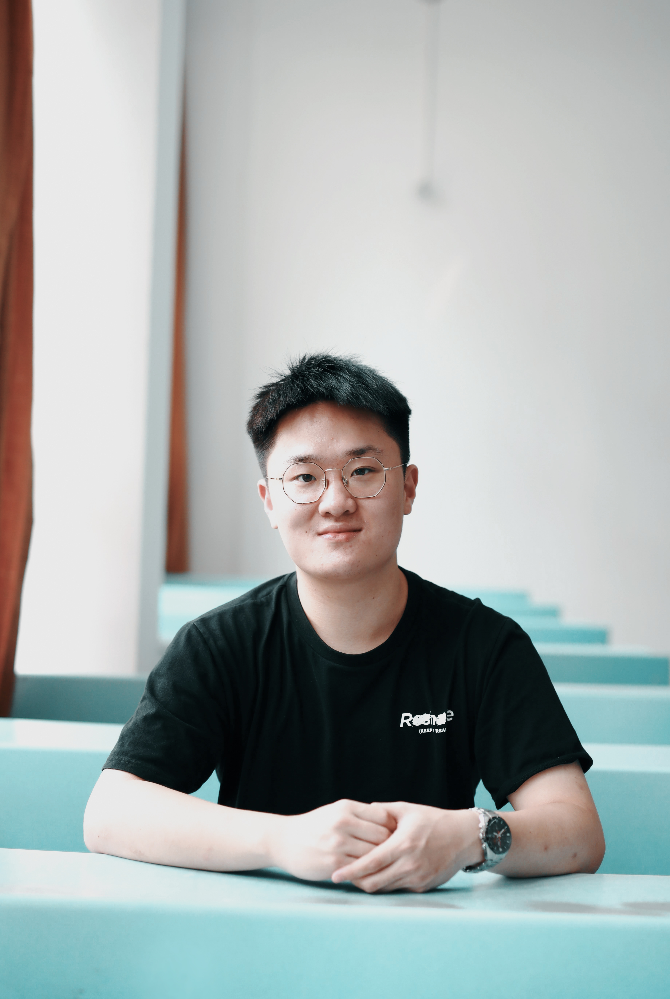

## About me

Hello, my name is Xiaojian Zhang, born and raised in China. You can also call me Chase :)

I'm a first-year PhD student in the [Department of Civil and Costal Engineering](https://www.essie.ufl.edu/civil-coastal-engineering/) at the [University of Florida](http://www.ufl.edu/), majoring in Transportation Engineering (see my lab [here]: (https://faculty.eng.ufl.edu/sermos-lab/)). I received her B.E. in Transportation Engineering from [Southwest Jiaotong University](https://en.swjtu.edu.cn/), China, in 2020. I was a Research Assistant in the Division of Engineering and Computer Science at [New York University Shanghai](https://shanghai.nyu.edu/) from 2020 to 2021. I am currently working on applying data science (e.g., data analytics and machine learning) on shared mobility research and redesigning demand-responsive paratransit system with optimization and simulation approaches.
